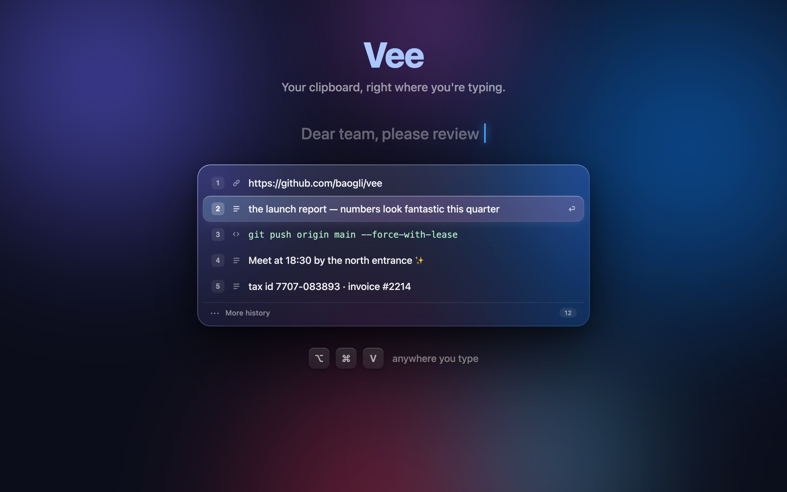

<div align="center">



# Vee

**Your clipboard, right where you're typing.**

No menu bar safari. No giant history window. Press <kbd>⌥</kbd><kbd>⌘</kbd><kbd>V</kbd> and the last few things you copied appear in a sheet of liquid glass — right at your text cursor. Tap a number. Done.


</div>

---

## Why Vee

Every clipboard manager wants to be a library: search, pins, folders, sync, a little database of everything you've ever copied. That's a lot of app for "paste the thing from two copies ago."

Vee is the opposite. It's a **clipboard tail** — the last N items, shown for two seconds, exactly where your eyes already are: at the caret.

> Copy and paste stay completely normal. <kbd>⌥⌘V</kbd> shows the recent tail at your cursor. A number or <kbd>Return</kbd> pastes. That's the whole product.

## What it feels like

- 🫧 **Liquid Glass, for real.** Native SwiftUI `glassEffect` on macOS 26 — actual refractive glass, not a gray rectangle. Graceful translucent-material fallback on macOS 14+.
- 🌊 **A selection that flows.** Hover, and an iridescent glass lens glides between rows like a droplet. Move the mouse away — it melts. Nothing stays stuck highlighted.
- 🎢 **Spring-launched.** The panel condenses out of thin air with a soft overshoot and a blur-to-focus settle. Rows cascade in one after another. Click anywhere outside — it fades and gets out of your way.
- 🎯 **Appears at the caret.** Vee reads the text-cursor bounds via Accessibility, so the popup opens where you're typing — not in a corner, not in the menu bar. (Mouse-position fallback for stubborn apps.)
- 🪶 **Focus never leaves your app.** It's a non-activating panel. Your document keeps the keyboard; Vee just floats above it.

## Use it

| Key | Action |
|-----|--------|
| <kbd>⌥</kbd><kbd>⌘</kbd><kbd>V</kbd> | Show / hide Vee |
| <kbd>1</kbd>–<kbd>9</kbd> | Paste that item instantly |
| <kbd>↑</kbd> <kbd>↓</kbd> | Move the glass lens |
| <kbd>Return</kbd> | Paste the selected item (or the freshest one) |
| <kbd>Esc</kbd> / click outside | Dismiss |

A small **More history** row reveals the rest of the in-memory tail — without turning Vee into a search-and-pin manager.

## Install

```bash
git clone https://github.com/baogli/vee.git
cd vee
open Vee.xcodeproj   # Xcode 26+, press ⌘R
```

On first launch, grant **Accessibility** permission (System Settings → Privacy & Security → Accessibility). Vee needs it for exactly two things:

1. Reading the text-cursor bounds, so the panel appears where you type.
2. Sending the synthetic <kbd>⌘V</kbd> after you pick an item.

## How pasting works

Vee briefly writes your pick to the system pasteboard, sends <kbd>⌘V</kbd> to the frontmost app, then **restores whatever was on the pasteboard before**. Your real clipboard is never hijacked.

Other details worth knowing:

- History lives **in memory only** — quit Vee and it's gone. Nothing is written to disk, nothing leaves your Mac.
- Content marked concealed (`org.nspasteboard.ConcealedType` — password managers use this) is **never recorded**.
- Clipboard monitoring is a light `changeCount` poll every 0.3 s.

## Vee vs. the heavyweights

|  | Vee | Typical clipboard manager |
|--|-----|---------------------------|
| Opens | at your text cursor | menu bar / hotkey window |
| Scope | recent tail | searchable library |
| Persistence | in-memory, session-only | database on disk |
| Pins, folders, sync | no, on purpose | yes |
| Time to paste | one keystroke + one digit | open, search, click |

Maccy is the closest spiritual cousin — minimal, fast, open source. Vee's one big difference is **placement**: it comes to you.

---

<div align="center">

Built with SwiftUI, AppKit, and an unreasonable amount of care about a 320-pixel popup.

</div>
